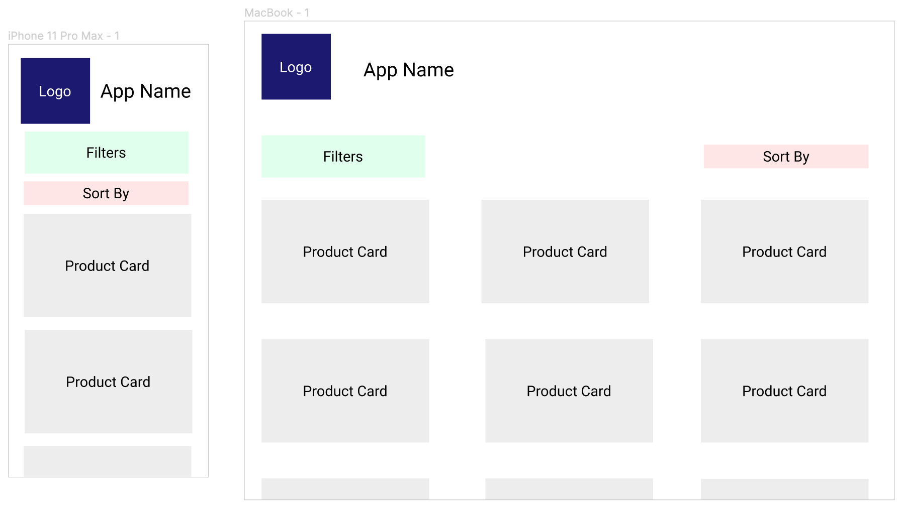

# Product Management

This is a simple product management application. The frontend is written in Javascript, using the React Library. The backend services are written in Java. Both must be running for the application to run successfully.

## Quick Start

**1. Clone the repository**

```bash
git clone https://github.com/rwardman/product-management.git
```

**2. Run the backend**

```bash
cd backend
mvn spring-boot:run
```

It should be running at [http://localhost:8080](http://localhost:8080).

**3. Run the UI**

```bash
cd ui
yarn
yarn start
```

Open [http://localhost:3000](http://localhost:3000) to view the application.

### Prerequisites

- Ensure the node version is >= 10.
- Ensure you have yarn installed
- Ensure the Java version is 11

## Running the application using Docker

To run the application using docker, from the main application directory simply run

```bash
docker-compose up
```

Open [http://localhost:3000](http://localhost:3000) to view the application.

To force a rebuild, run

```bash
docker-compose up --build
```

## Application Functionality

- **Pulls a set of products from a persistence layer**

  - Products and categories are pulled from CSVs.
  - The data is accessible via two services, a categories and products service.

- **List the above products in a UI**

  - The products are listed in a responsive, mobile first layout.

- **Sort the products by Name, Size, and Cateogry in the UI**

  - Ability to sort by Id, Name (Ascending), Name (Descending), and Size.
  - Filter by the Category, whilst maintaining the chosen sort.

- **Keep the products persisted even after the application has shut down**
  - localStorage in the UI maintains the state after the application has shutdown.
  - Chosen sort/filter is also maintained

## Backend

The backend is written in Java, using Spring Boot using the MVC design pattern and using Maven. There are corresponding tests for each of the services and controllers, with a high level of test coverage.

### Improvements

- Add new functionality such as a search service.
- Functionality to modify and delete data.

## Data

The data for this application is loaded from two CSV files, using a `@PostConstruct` annotation that runs only once when the application starts.

### Improvements

- The data source should be replaced with a database, such as Postgres.

## Frontend

The frontend is written in JavaScript using the React Library. The frontend uses Axios to retreive data from the backend. The application is styled using styled components.

### Improvements

- A greater focus on accessibility
- New features. Possibilities include search, display a single product, and allow editing

### The Design

The design of the frontend is based on the principles of responsive, mobile first design. Initial app designs focus on identifying the components necessary to build the application, to ensure components are reusable where appropriate.


